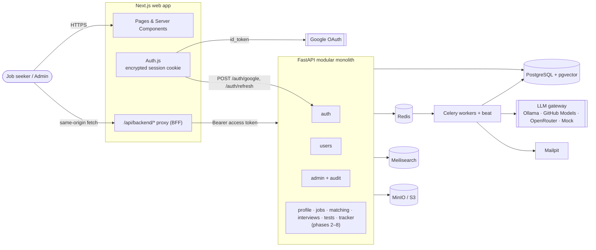
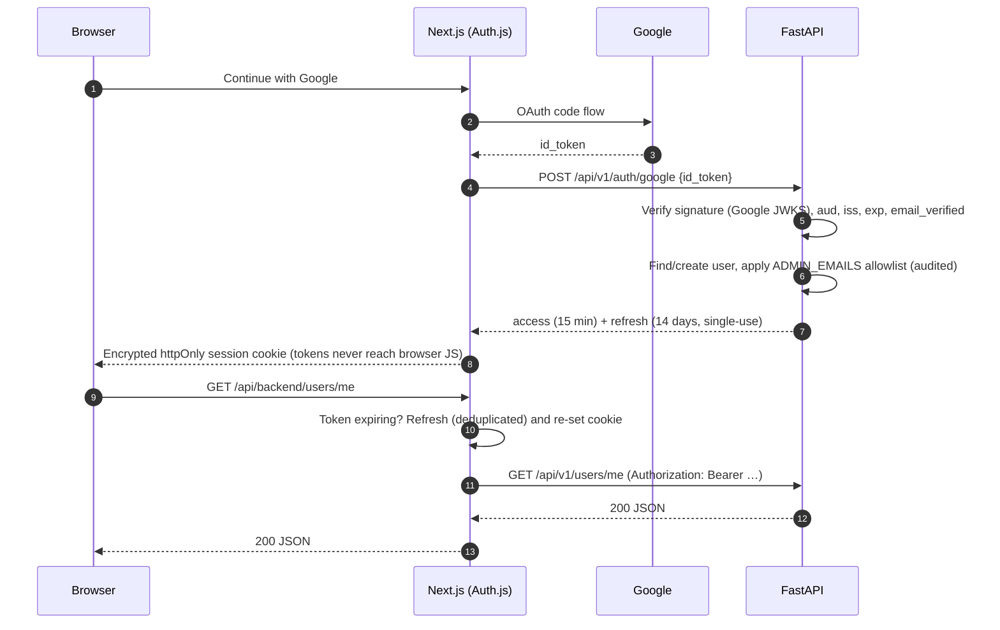
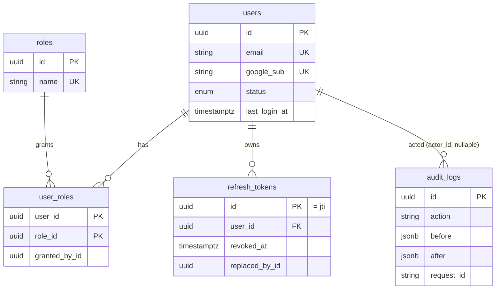

# GlideUp architecture

GlideUp is a **modular monolith** (one FastAPI deployable with strict module boundaries), a
**Next.js** web app that also acts as a **backend-for-frontend**, and **Celery** workers for
anything slow or scheduled. Everything runs locally in Docker Compose; every external address
and secret comes from environment variables, so moving to Azure is a configuration change.

## System context

## Sign-in and token flow

Details and trade-offs: [ADR 0003](adr/0003-auth-tokens-and-bff.md).

## Backend layout

| Path | Responsibility |
|---|---|
| `app/core` | Settings, structured logging, error envelope, JWT, RBAC, request-ID middleware |
| `app/db` | SQLAlchemy base/mixins, async session, models, Alembic migrations |
| `app/api/v1` | HTTP routers — thin: validate, call a module service, shape the response |
| `app/modules/<name>` | Use-cases (services). Modules talk to each other only through service functions |
| `app/workers` | Celery app, schedules, cross-cutting tasks |

Rules: routers never contain business logic; services never import FastAPI; every privileged
change writes an `audit_logs` row **in the same transaction**.

## Request lifecycle (API)

1. `RequestContextMiddleware` assigns/propagates `X-Request-ID`, binds it to every log line.
2. `get_current_user` decodes the access token and **loads the user on every request**, so
   suspensions and role changes take effect immediately (not when the token expires).
3. `require_permission(...)` checks permissions (never role names) on the server.
4. `get_session` opens one transaction per request: commit on success, roll back on error.
5. Errors leave as `{"error": {code, message, details, request_id}}`.

## Data model (Phase 1)

The `vector` extension is enabled in the first migration; embedding columns arrive in Phases 2 and 4.

## Cloud mapping (target, ~3 months)

| Local | Azure |
|---|---|
| Docker Compose services | Azure Container Apps (api, worker, beat, web) |
| PostgreSQL + pgvector | Azure Database for PostgreSQL Flexible Server (pgvector extension) |
| Redis | Azure Cache for Redis |
| MinIO | Azure Blob Storage (S3-compatible adapter or Blob client behind the storage interface) |
| Meilisearch | Meilisearch container on Container Apps (or Azure AI Search behind the search interface) |
| Ollama / GitHub Models | Azure OpenAI behind the same `LLMProvider` interface |
| Prometheus/Grafana + JSON logs | Azure Monitor / Application Insights |
